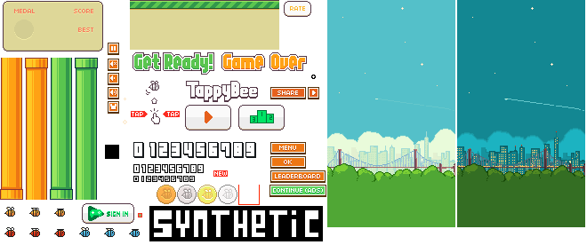
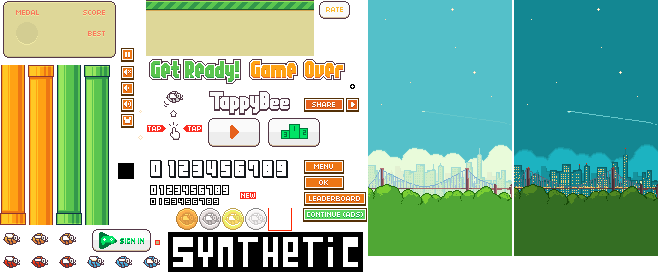
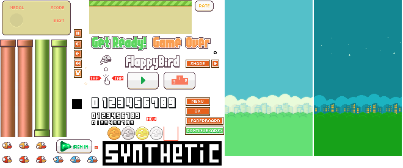

# Tappy Bee Custom Textures Repository

This repository provides textures that can be used to modify the appearance of the Android game **Tappy Bee**.



## How to Use Custom Textures

To use a custom texture in **Tappy Bee**, follow these steps:

1. Locate the original texture at:
   ```
   /original/spritesheet.png
   ```
   This file serves as a reference for creating new skins.

2. Create your own custom texture based on the original **spritesheet.png**.
   - The new file **must** be in PNG format.
   - Name it exactly as: `custom_texture.png`

3. Place the customized file in the following directory on your Android device:
   ```
   /storage/emulated/0/Android/data/network.synthetic.tappybee/files/custom_texture.png
   ```

4. Restart the game to see your custom texture applied.

## Texture format

Use the default texture as reference.  
Only point to consider is the color at (157,242)  
- This used to adjust size and offset of character texture while drawing (collider not affected) using rgba value
- r : used to control x offset. ie xoffset = (color.r - 127.5) . ie -127.5 to +127.5
- g : used to control y offset. ie yoffset = (color.r - 127.5) . ie -127.5 to +127.5
- b : not used
- a : scale of whole character. scale = (color.a / 127.5) ie 0 to 2

## Reverting to Default Texture

If you want to revert to the default texture:
- Simply **rename or delete** the `custom_texture.png` file.

## Important Notes

- The Android system may automatically remove custom textures when the game is reinstalled.
- Users are encouraged to contribute their custom textures to this repository.
- Contributions should follow the structure of the original texture to ensure compatibility.

## Contributing

If you've created an interesting skin and want to share it with others:
- Fork this repository.
- Add your custom texture in an appropriate directory.
- Submit a pull request for review.

We appreciate contributions and creative skins from the community! 🎨🐝

## Textures

### 1.Orginal Texture


### 2.Old Texture


### 3.Flappy Bird
